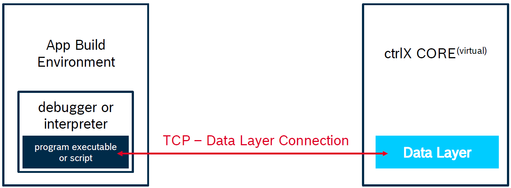

# Debugging Snaps

## Overview

In general there are three different ways to debug. Here is an overview of the different types of debugging:

| # | Description                | Usage                                     |Disadvanges        |
| :--| :-------------------------| :----------------------------------------------------- |:-------------|
| __1__| __Snap Logs__   output in terminal and logbook   | <ul><li>easiest way of debugging</li><li>can be used in every programming language</li><li>code runs on target</li></ul>      |  <ul><li>no breakpoints</li><li>no step by step debugging</li></ul>  |
| __2__| __Debugging in Build Environment__  + Connection to Data Layer via TCP       |<ul><li>easy way to debug</li><li>Implemented in the SDK for all samples</li></ul> | <ul><li>Code does not run on target</li><li>Connection via tcp to Data Layer is slower then IPC</li></ul>  |
| __3__| __Remote Debugging__  | <ul><li>Only use this if you see a different behavior on the real hardware then in your build environment</li><li>Documentation for C++, Python</li><li>code runs on target</li></ul> |  <ul><li>Very very high effort </li></ul>  |

We recommend to test your application extensively in the build environment (type #2). Testing an application running in it's confined Ubuntu Core snap enviroment can be done by looking at the snap logs (type #1). Remote Debugging (type #3) while the snap is running in the confined Ubuntu Core snap environment of a ctrlX CORE should only be used as the last step, if the other two debug types don't help to debug your application. 

Common and important information about debugging snaps are provided by snapcraft: [Debugging snaps](https://snapcraft.io/docs/debug-snaps)

In the following you can see how to set up the three different types of debugging. 

## 1. Snap Logs

First build the snap using the right build-snap script and install it on a ctrlX CORE or ctrlX COREvirtual. 

You can see the snaps logs in the Diagnostics Logbook on the webpage of the ctrlX CORE or in the console. To see them in the console you need to log in via ssh to the ctrlX CORE. To enable ssh on your ctrlX CORE you would need an system user with extended rights on the ctrlX CORE.

!!! Command
    The log output of a snap can be checked with `sudo snap logs -f snapname` in the console. 

To see the same output of the snap logs in the Diagnostics/Logbook on the ctrlX CORE no system User is needed. Just enable to "Show System Messages" in the settings of the logbook. 

## 2. Debugging in Build Environment

It's recommended to debug your application in your app build environment. You can run script files directly in your build environment with an interpreter (e.g. Python) or run compiled executables with an Debugger (e.g. C++). 

The samples in the SDK already contain a launch.json in the folder .vscode, which makes it easy for you to debug the samples using Visual Studio Code as your source code editor. 

For the prerequisites for every programming language please see the corresponding documentation in Samples. 

## 3. Remote Debugging

Remote Debugging should only be used as the last step, if the other two debug types don't help to debug your application. For detailed information on this debugging, please see the following descriptions:

* For C++: [Remote Debugging C++ Snaps](./remote-debug-cpp.md)

* For Python: [Remote Debugging Python Snaps](./remote-debug-python.md)

