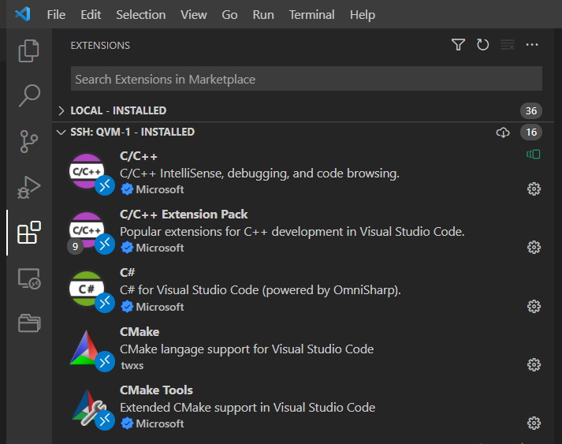

# Setup ctrlX AUTOMATION Development Environment using VirtualBox

## Overview

This guide shows how to use an [Ubuntu Desktop](https://ubuntu.com/desktop/developers) running in a virtual machine using the [ORACLE VM VirtualBox](https://www.virtualbox.org/) on a Windows 10 host system as a development environment to develop ctrlX AUTOMATION Apps.
This setup gives you a seamless development environment for Linux applications when you don't have the possibility to setup a native Linux Operating System on your PC (e.g. if you are in a Windows based corporate network). 

### Prerequisites

* You need to have admin rights on your Windows system to be able to install the software.
* Windows 10 with all updates.

## Install ORACLE VM VirtualBox

Install [ORACLE VM VirtualBox](https://www.virtualbox.org/). The software can be downloaded from here: <https://www.virtualbox.org/.>

## Setup Virtual Machine and install Ubuntu Distribution

Once installed setup a new virtual machine to host your Ubuntu guest system. For the installation of the Ubuntu Operating System, download an iso-Image.

It is recommended to use Ubuntu Desktop 20.04 LTS from here: <https://old-releases.ubuntu.com/releases/focal/>

* Create a virtual machine running the Ubuntu, recommendation:
* min 8 Gb Ram
  * min 15 Gb Disk, VDI Type
  * all processors
  * insert Ubuntu *.iso into virtual CD Drive
  * Map free internet connection via network settings (Adapter 1, Bridged Adapter)
  * Map real/virtual control via network settings (Adapter 2, Bridged Adapter)
* Start machine and follow installation instructions
* Install Virtual Box GuestAdditions
* Configure IP Address to connect to your control

### Setup Corporate Proxy (Optional)

If you are in a corporate environment, which uses a http-Proxy, then you may want to set the proxy configuration to be able to download software from within your distribution.
For this, you want to run a proxy on your Windows environment and redirect the distribution to this proxy running on localhost. If you are directly connected to a router or the internet, then this step can be skipped.
A recommended proxy program to be used on your Windows host system is <https://github.com/genotrance/px>.

To set the environment variable in the distribution use:

    sudo nano /etc/environment

Add the following variables:

    http_proxy="http://10.0.2.2:3128"
    https_proxy="http://10.0.2.2:3128"
    HTTP_PROXY="http://10.0.2.2:3128"
    HTTPS_PROXY="http://10.0.2.2:3128"

You need to set this configuration also for `wget`.

    sudo nano /etc/wgetrc

Search for the http proxy settings and make sure you configure:

    https_proxy = http://10.0.2.2:3128/
    http_proxy = http://10.0.2.2:3128/
    use_proxy = on

### Setup Packages

You might want to update your distribution and install essential packages for development.

    sudo apt update
    sudo apt upgrade
    sudo apt install ssh zip unzip git curl cifs-utils apt-transport-https ca-certificates openssh-client

The following packages are needed for software development of ctrlX AUTOMATION apps.

    sudo apt install crossbuild-essential-arm64 cmake snapcraft gcc gdb

For Python install the additional python packages:

    sudo apt-get install python3
    sudo apt-get install python3-pip

Furthermore, we recommend to use virtual python environments when you are developing python apps. Therefore, you need to install virtualenv:

    sudo apt-get install virtualenv

### Dependencies for Crossbuild (Multiarch)

Multiarch lets you install library packages from multiple architectures on the some machine. This is useful in various ways, but the most common is installing 64 and 32-bit software on the same machine and having dependencies correctly resolved automatically. In our way we use multiple architectures. In general, you can have libraries of more than one architecture installed together and applications from one architecture or another installed as alternatives. Additional information can be found here [Multiarch](https://wiki.ubuntu.com/MultiarchSpec).

Be sure that apt can connect to the internet.

Run the commands below as root user:

    sudo dpkg --add-architecture arm64
    sudo sh -c 'echo "deb [arch=arm64] http://ports.ubuntu.com/ focal main restricted universe" >> /etc/apt/sources.list.d/multiarch-libs.list'
    sudo sh -c 'echo "deb [arch=arm64] http://ports.ubuntu.com/ focal-updates main restricted universe" >> /etc/apt/sources.list.d/multiarch-libs.list'
    sudo apt-get clean
    sudo apt-get update

After apt-get update, you might get some warnings like: `Failed to fetch http://de.archive.ubuntu.com/ubuntu/dists/focal/universe/binary-arm64/Packages`. To avoid it add the vendor with the host architecture `[arch=i386,amd64]` to your sources list `/etc/apt/sources.list`.

For example:
`deb [arch=i386,amd64] http://de.archive.ubuntu.com/ubuntu/ focal main restricted`

Now it is possible to download packages for other architectures. For building the examples, you need to install additional libraries

    sudo apt-get install libsystemd-dev:arm64
    sudo apt-get install libsystemd-dev:amd64
    sudo apt-get install libssl-dev:amd64
    sudo apt-get install libssl-dev:arm64

## Install Visual Studio Code

Install Visual Studio Code on your windows environment as described here: https://code.visualstudio.com.
Or use the integrated software downloader of Ubuntu.

In order to compile all examples of the SDK you will need to install additional extensions. 
This can be done easily from within VS Code as soon as you open a project. In the extension windows you can search for extensions.

Make sure to have at least the following extensions installed.

## Install the SDK

Copy the complete contents of this SDK into your Ubuntu Desktop system. It is recommended to copy the SDK to the `home` directory of your user.
